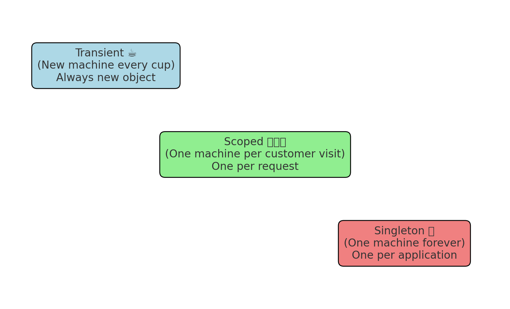

# ☕ Dependency Injection Lifetimes in ASP.NET Core


---

## 📖 Overview
This repository explains **Dependency Injection (DI) lifetimes in ASP.NET Core** with a fun **coffee shop analogy**.  
You’ll never forget the difference between **Transient, Scoped, and Singleton** again!  

---

## 🏪 Coffee Shop Story

Imagine your **ASP.NET Core app** is a **coffee shop**.  
Services are like **coffee machines** that make coffee (logic).  

### 🔑 Three lifetimes = how long the coffee machine is kept alive.

---

## 1. Transient ☕ (New machine every cup)
- Every time a customer asks for coffee, the shop buys a **brand new machine**, uses it once, then throws it away.  
- Cheap if it’s a light service, but wasteful for heavy ones.  

```csharp
builder.Services.AddTransient<ICoffeeService, CoffeeService>();
```

➡️ Each request (each time injected) = **new object**.

---

## 2. Scoped 🧑‍🤝‍🧑 (One machine per customer visit)
- When a customer enters the shop, they get **one coffee machine**.  
- They use the same machine for all coffees during their stay.  
- When they leave, the machine is thrown away.  

```csharp
builder.Services.AddScoped<ICoffeeService, CoffeeService>();
```

➡️ One **instance per HTTP request**.  
Most common for services that talk to the **database**.

---

## 3. Singleton 🏆 (One machine forever)
- The shop buys **one expensive coffee machine** when it opens.  
- Everyone uses that same machine forever, until the shop closes.  

```csharp
builder.Services.AddSingleton<ICoffeeService, CoffeeService>();
```

➡️ One instance for the **whole application lifetime**.  
Best for services that are **stateless and heavy to create** (like configuration, logging, caching).

---

## 🔎 Quick Summary
- **Transient** → "Always new" (like disposable cups).  
- **Scoped** → "One per request" (like a coffee machine per customer visit).  
- **Singleton** → "One forever" (like the shop’s main espresso machine).  

---

## 🧑‍💻 Real Example

`Program.cs`:

```csharp
builder.Services.AddTransient<ITransientService, MyService>();
builder.Services.AddScoped<IScopedService, MyService>();
builder.Services.AddSingleton<ISingletonService, MyService>();
```

Service class:

```csharp
public class MyService
{
    public Guid Id { get; } = Guid.NewGuid();
}
```

Controller:

```csharp
public class TestController : Controller
{
    private readonly ITransientService _transient;
    private readonly IScopedService _scoped;
    private readonly ISingletonService _singleton;

    public TestController(ITransientService transient, IScopedService scoped, ISingletonService singleton)
    {
        _transient = transient;
        _scoped = scoped;
        _singleton = singleton;
    }

    public IActionResult Index()
    {
        return Ok(new {
            Transient = _transient.Id,
            Scoped = _scoped.Id,
            Singleton = _singleton.Id
        });
    }
}
```

### 🧪 What happens:
- **Refresh the page once:**  
  - Transient = new Id every time  
  - Scoped = same Id across this request  
  - Singleton = same Id across all requests  
- **Refresh again:**  
  - Transient changes  
  - Scoped changes (new request)  
  - Singleton stays the same  

---

## ☕ Coffee Shop Analogy Diagram



---

## 📂 Repository Usage
1. Clone this repo.  
2. Open in Visual Studio / VS Code.  
3. Run the project and hit the endpoint.  
4. Observe how `Transient`, `Scoped`, and `Singleton` behave.  

---

## 📜 License
This project is licensed under the MIT License – free to use, modify, and share.

🔥 With this coffee shop story, you’ll **never forget** DI lifetimes.
